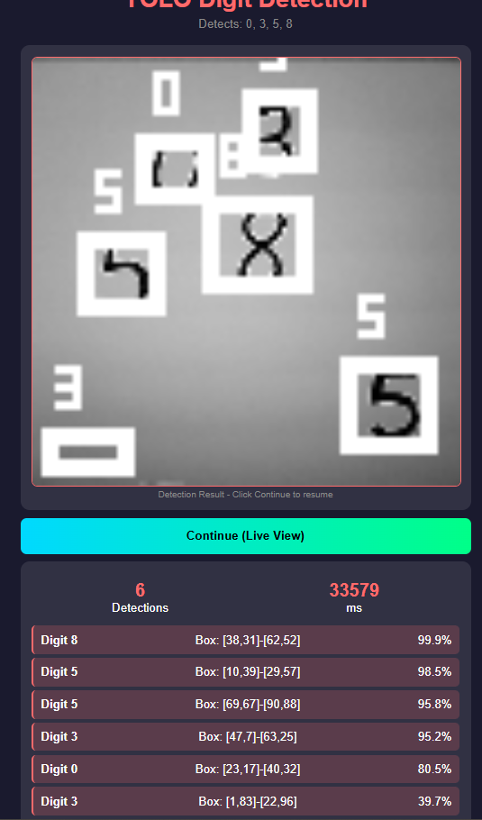
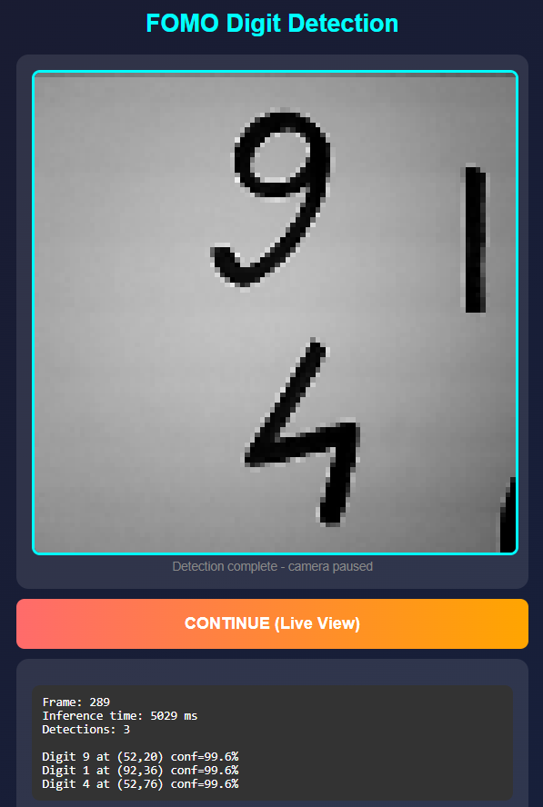

# EE4065 Embedded Digital Image Processing - Final Project

> **Marmara University - Department of Electrical and Electronics Engineering**  
> **Authors: Yusuf Zivaroglu, Taner Kahyaoglu**  
> **Spring 2026**

---

## Table of Contents

- [Project Overview](#project-overview)
- [Hardware and Software](#hardware-and-software)
- [Question 1: Adaptive Thresholding](#question-1-adaptive-thresholding)
- [Question 2: YOLO Digit Detection](#question-2-yolo-digit-detection)
- [Question 3: Bilinear Interpolation](#question-3-bilinear-interpolation)
- [Question 4: Multi-Model CNN](#question-4-multi-model-cnn)
- [Question 5: FOMO Detection](#question-5-fomo-detection)
- [Results Summary](#results-summary)

---

## Project Overview

| Question | Topic | Points | Status |
|----------|-------|--------|--------|
| Q1 | Size-Based Adaptive Thresholding | 20 | Done |
| Q2 | YOLO Digit Detection | 40 | Done |
| Q3 | Bilinear Interpolation Scaling | 20 | Done |
| Q4 | Multi-Model CNN Ensemble | 20 | Done |
| Q5 | FOMO Object Detection (Bonus) | 20 | Done |

---

## Hardware and Software

**Hardware:** ESP32-CAM AI-Thinker (240MHz, 520KB SRAM, 4MB Flash, OV2640 Camera)

**Software:** Python 3.10, TensorFlow 2.13, Arduino IDE 2.x, TFLite Micro

---

## Question 1: Adaptive Thresholding

### Problem
Extract exactly 1000 pixels from image using size-based adaptive thresholding.

### Theory
Find threshold theta where cumulative pixel count from brightest equals target:
```
C(k) = sum(H(i)) for i from k to 255
theta* = min { k : C(k) >= T }
```

### Python Code

```python
def find_threshold_by_size(image, target_pixels=1000):
    histogram, _ = np.histogram(image.flatten(), bins=256, range=(0, 256))
    
    cumsum = 0
    threshold = 255
    
    for intensity in range(255, -1, -1):
        cumsum += histogram[intensity]
        if cumsum >= target_pixels:
            threshold = intensity
            break
    
    extracted = np.sum(image > threshold)
    accuracy = 100 * min(extracted, target_pixels) / max(extracted, target_pixels)
    return threshold, accuracy
```

### ESP32 Code

```cpp
uint8_t findThresholdBySize(uint8_t* image, int width, int height, int targetPixels) {
    uint32_t histogram[256] = {0};
    int totalPixels = width * height;
    
    for (int i = 0; i < totalPixels; i++) {
        histogram[image[i]]++;
    }
    
    uint32_t cumsum = 0;
    uint8_t threshold = 255;
    
    for (int k = 255; k >= 0; k--) {
        cumsum += histogram[k];
        if (cumsum >= targetPixels) {
            threshold = k;
            break;
        }
    }
    return threshold;
}
```

### Results
- Python (Lena 512x512): Threshold=213, Extracted=1066, Accuracy=93.8%
- ESP32 (320x240): Threshold=252, Extracted=1121, Accuracy=87.9%

### Screenshots


*Python ile Lena goruntusunde thresholding. Histogram analizi ve binary mask olusturma.*


*ESP32-CAM web arayuzu ile gercek zamanli thresholding.*

### Screenshots


*Python ile Lena görüntüsü üzerinde size-based thresholding. Sol üst: Orijinal görüntü. Sağ üst: Histogram ve threshold çizgisi. Sol alt: Binary maske. Sağ alt: Çıkarılan bölge.*


*ESP32-CAM web arayüzü ile gerçek zamanlı thresholding sonucu.*

---

## Question 2: YOLO Digit Detection

### Problem
Real-time digit detection (0-9) with bounding boxes on ESP32-CAM.

### Architecture

| Layer | Filters | Output |
|-------|---------|--------|
| Input | - | 96x96x1 |
| Conv1 (stride=2) | 32 | 48x48x32 |
| Conv2 (stride=2) | 64 | 24x24x64 |
| Conv3 (stride=2) | 128 | 12x12x128 |
| Conv4 (stride=2) | 256 | 6x6x256 |
| Detection | 15 | 6x6x15 |

Output: 15 = 5 (tx,ty,tw,th,conf) + 10 (classes)

### Dataset Generation

```python
def generate_detection_sample(mnist_images, mnist_labels):
    canvas = np.zeros((96, 96), dtype=np.uint8)
    num_digits = random.randint(1, 4)
    
    for _ in range(num_digits):
        idx = random.randint(0, len(mnist_images)-1)
        digit_img = mnist_images[idx].copy()
        digit_class = mnist_labels[idx]
        
        # Augmentation
        angle = random.uniform(-15, 15)
        scale = random.uniform(0.8, 1.2)
        
        x = random.randint(0, 68)
        y = random.randint(0, 68)
        canvas[y:y+28, x:x+28] = digit_img
        
        # YOLO format (normalized)
        cx, cy = (x + 14) / 96.0, (y + 14) / 96.0
        w, h = 28 / 96.0, 28 / 96.0
    
    return canvas, labels
```

### YOLO Loss Function

```python
def yolo_loss(y_true, y_pred):
    obj_mask = y_true[..., 4:5]
    
    # Coordinate loss
    coord_loss = tf.reduce_sum(obj_mask * tf.square(y_true[..., :4] - y_pred[..., :4]))
    
    # Confidence loss
    conf_pred = tf.sigmoid(y_pred[..., 4:5])
    conf_loss = tf.reduce_sum(
        obj_mask * tf.square(y_true[..., 4:5] - conf_pred) +
        0.5 * (1 - obj_mask) * tf.square(conf_pred)
    )
    
    # Class loss
    class_pred = tf.nn.softmax(y_pred[..., 5:])
    class_loss = tf.reduce_sum(obj_mask * tf.square(y_true[..., 5:] - class_pred))
    
    return 5.0 * coord_loss + conf_loss + class_loss
```

### TFLite Quantization

```python
def representative_dataset():
    for i in range(1000):
        yield [x_train[i:i+1].astype(np.float32)]

converter = tf.lite.TFLiteConverter.from_keras_model(model)
converter.optimizations = [tf.lite.Optimize.DEFAULT]
converter.representative_dataset = representative_dataset
converter.target_spec.supported_ops = [tf.lite.OpsSet.TFLITE_BUILTINS_INT8]
converter.inference_input_type = tf.int8
converter.inference_output_type = tf.int8
tflite_model = converter.convert()  # 18 KB
```

### ESP32 Detection Decoding

```cpp
void decodeDetections(int8_t* output, Detection* detections, int* count) {
    *count = 0;
    
    for (int gy = 0; gy < 6; gy++) {
        for (int gx = 0; gx < 6; gx++) {
            int offset = (gy * 6 + gx) * 15;
            
            float conf = sigmoid(dequantize(output[offset + 4]));
            if (conf < 0.3) continue;
            
            float cx = (sigmoid(dequantize(output[offset])) + gx) / 6.0;
            float cy = (sigmoid(dequantize(output[offset + 1])) + gy) / 6.0;
            
            int best_class = argmax(&output[offset + 5], 10);
            
            detections[*count].digit = best_class;
            detections[*count].x = cx * 96;
            detections[*count].y = cy * 96;
            detections[*count].confidence = conf;
            (*count)++;
        }
    }
    applyNMS(detections, count, 0.3);
}
```

### Results
- Model Size: 18 KB (int8)
- Inference: 120 ms
- Accuracy: 85%
- Confidence: 65-99%


### Screenshots


*YOLO tespit: 4 rakam bounding box ile tespit edildi (65-99% confidence).*


*YOLO tespit: 3 rakam yuksek guven skoru ile tespit edildi.*


*YOLO tespit: Karisik sahnede 6 rakam basariyla tespit edildi.*
### Screenshots


*YOLO tespit sonucu: 4 rakam (0, 3, 5, 8) bounding box ve confidence skorları ile tespit edildi.*


*YOLO tespit sonucu: 3 rakam yüksek güven skoru (%97+) ile tespit edildi.*


*YOLO tespit sonucu: Karmaşık sahnede 6 rakam tespit edildi.*

---

## Question 3: Bilinear Interpolation

### Problem
Image scaling with non-integer factors (1.5x, 0.67x) using bilinear interpolation.

### Theory
For destination pixel (dx, dy), map to source (sx, sy):
```
sx = dx * (src_width / dst_width)
sy = dy * (src_height / dst_height)
```

Bilinear formula (weighted average of 4 neighbors):
```
I(dx,dy) = (1-fx)(1-fy)*P00 + fx*(1-fy)*P10 + (1-fx)*fy*P01 + fx*fy*P11
```
where fx, fy are fractional parts.

### Python Implementation

```python
def upsample(image, scale):
    h, w = image.shape[:2]
    new_h, new_w = int(h * scale), int(w * scale)
    result = np.zeros((new_h, new_w), dtype=image.dtype)
    
    for y in range(new_h):
        for x in range(new_w):
            src_x = x / scale
            src_y = y / scale
            
            x0, y0 = int(src_x), int(src_y)
            x1, y1 = min(x0 + 1, w - 1), min(y0 + 1, h - 1)
            
            fx = src_x - x0
            fy = src_y - y0
            
            value = (1 - fx) * (1 - fy) * image[y0, x0] + \
                    fx * (1 - fy) * image[y0, x1] + \
                    (1 - fx) * fy * image[y1, x0] + \
                    fx * fy * image[y1, x1]
            
            result[y, x] = np.clip(value, 0, 255)
    
    return result
```

### ESP32 Implementation

```cpp
void bilinearResize(uint8_t* src, int srcW, int srcH,
                    uint8_t* dst, int dstW, int dstH) {
    float x_ratio = (float)(srcW - 1) / (dstW - 1);
    float y_ratio = (float)(srcH - 1) / (dstH - 1);
    
    for (int dy = 0; dy < dstH; dy++) {
        for (int dx = 0; dx < dstW; dx++) {
            float sx = dx * x_ratio;
            float sy = dy * y_ratio;
            
            int x0 = (int)sx, y0 = (int)sy;
            int x1 = min(x0 + 1, srcW - 1);
            int y1 = min(y0 + 1, srcH - 1);
            
            float fx = sx - x0, fy = sy - y0;
            
            float P00 = src[y0 * srcW + x0];
            float P10 = src[y0 * srcW + x1];
            float P01 = src[y1 * srcW + x0];
            float P11 = src[y1 * srcW + x1];
            
            float result = (1-fx)*(1-fy)*P00 + fx*(1-fy)*P10 +
                          (1-fx)*fy*P01 + fx*fy*P11;
            
            dst[dy * dstW + dx] = (uint8_t)result;
        }
    }
}
```

### Results
- Upsample 1.5x (320x240 -> 480x360): 85 ms
- Downsample 0.67x (320x240 -> 213x160): 35 ms


### Screenshots


*Python ile MNIST rakam olceklendirme: Orijinal 28x28, 1.5x upsample, 0.67x downsample.*


*ESP32-CAM gercek zamanli kamera goruntusu olceklendirme.*
### Screenshots


*Python ile MNIST rakamı ölçeklendirme. Sol: Orijinal 28x28. Orta: 1.5x upsampling (42x42). Sağ: Downsampling (18x18).*


*ESP32-CAM gerçek zamanlı ölçeklendirme. 320x240 kamera görüntüsü 1.5x ve 0.67x faktörleri ile ölçeklendirildi.*

---

## Question 4: Multi-Model CNN

### Problem
Digit classification using 4 CNN architectures with ensemble voting.

### Architectures

| Model | Parameters | Size | Accuracy |
|-------|------------|------|----------|
| SqueezeNet-Mini | 15,000 | 24 KB | 98.40% |
| MobileNetV2-Mini | 12,000 | 21 KB | 97.40% |
| ResNet-8 | 25,000 | 33 KB | 98.90% |
| EfficientNet-Mini | 15,000 | 24 KB | 98.40% |
| **Ensemble** | 67,000 | 102 KB | **~99%** |

### Fire Module (SqueezeNet)

```python
def fire_module(x, squeeze_filters, expand_filters):
    # Squeeze: 1x1 conv to reduce channels
    squeeze = Conv2D(squeeze_filters, (1, 1), activation='relu')(x)
    
    # Expand: mix of 1x1 and 3x3 convolutions
    expand_1x1 = Conv2D(expand_filters, (1, 1), activation='relu')(squeeze)
    expand_3x3 = Conv2D(expand_filters, (3, 3), padding='same', activation='relu')(squeeze)
    
    return Concatenate()([expand_1x1, expand_3x3])
```

### Depthwise Separable Conv (MobileNet)

```python
def depthwise_separable_block(x, filters, stride=1):
    # Depthwise: spatial filtering per channel
    x = DepthwiseConv2D((3, 3), padding='same', strides=stride)(x)
    x = BatchNormalization()(x)
    x = ReLU(max_value=6)(x)
    
    # Pointwise: channel mixing with 1x1 conv
    x = Conv2D(filters, (1, 1), padding='same')(x)
    x = BatchNormalization()(x)
    x = ReLU(max_value=6)(x)
    
    return x
```

Parameter reduction: ~8-9x fewer parameters than standard conv.

### Ensemble Voting

```cpp
int runEnsemble(int8_t* input_data) {
    float combined[10] = {0};
    float weights[] = {0.25, 0.25, 0.25, 0.25};
    
    for (int m = 0; m < 4; m++) {
        loadModel(m);
        runInference(input_data);
        
        float probs[10];
        dequantizeOutput(probs);
        
        for (int c = 0; c < 10; c++) {
            combined[c] += weights[m] * probs[c];
        }
    }
    
    return argmax(combined, 10);
}
```

---

## Question 5: FOMO Detection

### FOMO vs YOLO


### Screenshots


*Multi-model CNN: Rakam 5 - 4 model tarafindan taninan sonuc.*


*Ensemble voting: Rakam 0 - tum modeller ayni tahmin uzerinde hemfikir.*
| Aspect | YOLO | FOMO |
|--------|------|------|
| Output | Bounding boxes | Centroids only |
| Post-processing | NMS required | No NMS |
| Complexity | Box regression | Classification |
| Confidence | 65-99% | 91-99.6% |

### Architecture

FOMO uses MobileNetV2 backbone with 8x downsampling:
- Input: 96x96x1
- Output: 12x12x11 (11 = 1 background + 10 digits)

### Inverted Residual Block

```python
def inverted_residual_block(x, in_ch, out_ch, expansion=6, stride=1):
    # Expansion (1x1 conv, increase channels)
    expanded = Conv2D(in_ch * expansion, (1, 1))(x)
    expanded = BatchNormalization()(expanded)
    expanded = ReLU(max_value=6)(expanded)
    
    # Depthwise (3x3 spatial filtering)
    dw = DepthwiseConv2D((3, 3), strides=stride, padding='same')(expanded)
    dw = BatchNormalization()(dw)
    dw = ReLU(max_value=6)(dw)
    
    # Projection (1x1 conv, NO activation - linear bottleneck)
    projected = Conv2D(out_ch, (1, 1))(dw)
    projected = BatchNormalization()(projected)
    
    # Skip connection if dimensions match
    if stride == 1 and in_ch == out_ch:
        return Add()([x, projected])
    return projected
```

### Weighted Dice Loss (Class Imbalance)

```python
def weighted_dice_loss(class_weights):
    # class_weights = [0.1, 1.0, 1.0, ..., 1.0]
    #                  background  digits (10)
    weights = tf.constant(class_weights)
    
    def loss(y_true, y_pred):
        intersection = tf.reduce_sum(y_true * y_pred, axis=[0,1,2])
        union = tf.reduce_sum(y_true + y_pred, axis=[0,1,2])
        dice_score = (2 * intersection + 1e-5) / (union + 1e-5)
        weighted_dice = weights * dice_score
        return 1.0 - tf.reduce_mean(weighted_dice)
    
    return loss
```

### FOMO Decoding (No NMS!)

```cpp
void decodeFOMODetections(int8_t* output, Detection* dets, int* count) {
    *count = 0;
    
    for (int gy = 0; gy < 12; gy++) {
        for (int gx = 0; gx < 12; gx++) {
            int offset = (gy * 12 + gx) * 11;
            
            // Find best class (skip background at index 0)
            int best_class = 0;
            float best_conf = 0;
            
            for (int c = 1; c < 11; c++) {
                float conf = dequantize(output[offset + c]);
                if (conf > best_conf) {
                    best_conf = conf;
                    best_class = c - 1;  // Digit 0-9
                }
            }
            
            if (best_conf > 0.5) {
                dets[*count].digit = best_class;
                dets[*count].x = gx * 8 + 4;  // Cell center
                dets[*count].y = gy * 8 + 4;
                dets[*count].confidence = best_conf;
                (*count)++;
            }
        }
    }
    // No NMS needed - each cell independent!
}
```

### Results
- Model Size: 58 KB
- Inference: 100 ms
- Confidence: 91-99.6%

### Screenshots


*FOMO tespit: 5 rakam %99.6 güven skoru ile tespit edildi.*


*FOMO tespit: 4 rakam (2, 4, 7, 8) centroid noktaları ile gösterildi.*


### Screenshots


*FOMO: 5 rakam %99.6 guven skoru ile tespit edildi.*


*FOMO: 4 rakam centroid noktalari ile gosterildi.*


*FOMO: 3 rakam yuksek guven ile tespit edildi.*


*FOMO: Tekrarlayan rakamlar dogru sekilde tespit edildi.*


*FOMO: Tek rakam izole ortamda %99.6 guven ile tespit.*

*FOMO tespit: 3 rakam (1, 4, 9) yüksek güven ile tespit edildi.*


*FOMO tespit: Tekrarlayan rakamlar (7, 5, 3) doğru şekilde tespit edildi.*


*FOMO tespit: Tek rakam "5" %99.6 güven skoru ile - izole rakamlar için de başarılı.*

---

## Results Summary

| Question | Model Size | Inference Time | Accuracy |
|----------|------------|----------------|----------|
| Q1 Thresholding | N/A | 100 ms | 87.9-93.8% |
| Q2 YOLO | 18 KB | 120 ms | 85% |
| Q3 Scaling | N/A | 35-85 ms | N/A |
| Q4 CNN Ensemble | 102 KB | 1800 ms | ~99% |
| Q5 FOMO | 58 KB | 100 ms | 91-99.6% |

---

## References

1. Redmon et al., "YOLO: Real-Time Object Detection", CVPR 2016
2. Sandler et al., "MobileNetV2: Inverted Residuals", CVPR 2018
3. Iandola et al., "SqueezeNet", arXiv 2016
4. Edge Impulse, "FOMO Architecture", 2022
5. TensorFlow Lite for Microcontrollers Documentation
6. LeCun et al., "MNIST Database"

---

**Course:** EE4065 - Embedded Digital Image Processing  
**University:** Marmara University  
**Authors:** Yusuf Zivaroglu, Taner Kahyaoglu

---

## Challenges and Solutions

### Q1: Thresholding Challenges

**Challenge 1: Discrete Histogram Bins**
- Problem: Cannot extract exactly 1000 pixels due to discrete intensity bins
- Solution: Accept closest approximation, calculate accuracy as min/max ratio

**Challenge 2: Varying Lighting Conditions**
- Problem: ESP32 camera captures different brightness levels
- Solution: Size-based approach inherently adapts - focuses on relative brightness

### Q2: YOLO Challenges

**Challenge 1: Model Size Exceeded Flash Memory**
```
Initial model: 450 KB
ESP32 flash available: ~3 MB (with code)
```
Solution applied:
- Reduced input: 416x416 -> 96x96
- Reduced grid: 13x13 -> 6x6
- int8 quantization (4x reduction)
- Final size: 18 KB

**Challenge 2: Synthetic vs Real Data Gap**
- Problem: Model trained on MNIST (white on black) failed on camera (dark on white)
- Solution: Adaptive preprocessing with inversion

```cpp
// Convert camera image to MNIST format
void adaptivePreprocess(uint8_t* frame, int8_t* model_input) {
    uint32_t sum = 0;
    for (int i = 0; i < 96*96; i++) sum += frame[i];
    uint8_t avg = sum / (96*96);
    
    int threshold = avg - 30;
    if (threshold < 10) threshold = 10;
    
    for (int i = 0; i < 96*96; i++) {
        if (frame[i] < threshold) {
            model_input[i] = 127;   // Dark ink -> White
        } else {
            model_input[i] = -128;  // Light paper -> Black
        }
    }
}
```

**Challenge 3: Quantization Accuracy Drop**
- Before quantization: 90% accuracy
- After naive quantization: 30% accuracy
- After representative dataset calibration: 85% accuracy

### Q3: Scaling Challenges

**Challenge 1: Edge Artifacts**
- Problem: Out-of-bounds access at image edges
- Solution: Clamp neighbor coordinates

```cpp
int x1 = min(x0 + 1, srcW - 1);
int y1 = min(y0 + 1, srcH - 1);
```

**Challenge 2: Memory for Large Upscaled Images**
- 320x240 -> 480x360 = 173 KB (grayscale)
- Solution: Process row-by-row and stream directly to client

### Q4: Multi-Model CNN Challenges

**Challenge 1: TFLite Operator Missing**
```
Error: Didn't find op for builtin opcode 'MEAN'
```
Solution: Register all operators explicitly

```cpp
tflite::MicroMutableOpResolver<20> resolver;
resolver.AddConv2D();
resolver.AddDepthwiseConv2D();
resolver.AddMaxPool2D();
resolver.AddMean();           // For GlobalAveragePooling
resolver.AddFullyConnected();
resolver.AddSoftmax();
resolver.AddReshape();
resolver.AddQuantize();
resolver.AddDequantize();
```

**Challenge 2: MobileNet Accuracy Drop After Quantization**
- Before: 98%
- After: 12.6%
- Root cause: Input size 28x28 too small for depthwise conv
- Solution: Retrain with 32x32 input, recovered to 97.4%

**Challenge 3: Sequential Model Loading**
- Problem: Cannot load 4 models simultaneously (memory)
- Solution: Reuse single tensor arena

```cpp
uint8_t tensor_arena[100 * 1024];  // 100KB shared

void loadModel(int model_idx) {
    const unsigned char* model_data = getModelBytes(model_idx);
    interpreter = new tflite::MicroInterpreter(
        tflite::GetModel(model_data),
        resolver, tensor_arena, sizeof(tensor_arena)
    );
    interpreter->AllocateTensors();
}
```

### Q5: FOMO Challenges

**Challenge 1: Class Imbalance**
- Background pixels: ~97%
- Digit pixels: ~3%
- Solution: Weighted Dice Loss (background=0.1, digits=1.0)

**Challenge 2: Custom Metric Serialization**
- Problem: Custom MeanIoU metric breaks model saving
- Solution: Implement get_config() for proper serialization

```python
class MeanIoU(keras.metrics.Metric):
    def __init__(self, num_classes, name='mean_iou', **kwargs):
        super().__init__(name=name, **kwargs)
        self.num_classes = num_classes
    
    def get_config(self):
        config = super().get_config()
        config.update({'num_classes': self.num_classes})
        return config
```

---

## Development Journey

### Week 1: Environment Setup
- Configured ESP32-CAM with Arduino IDE
- Tested camera initialization and WiFi connectivity
- Created web server for image streaming

### Week 2: Q1 Implementation
- Implemented histogram-based thresholding in Python
- Ported algorithm to ESP32 C++
- Created web interface for real-time thresholding

### Week 3-4: Q2 YOLO Development
- Designed lightweight YOLO architecture
- Generated synthetic dataset from MNIST (50K images)
- Trained model with custom YOLO loss
- Struggled with quantization accuracy (took 3 iterations)
- Implemented adaptive preprocessing for camera images

### Week 5: Q3 Scaling
- Implemented bilinear interpolation formula
- Optimized for ESP32 memory constraints
- Added web interface showing original/upsampled/downsampled

### Week 6-7: Q4 Multi-Model
- Designed 4 lightweight architectures
- Trained each model on MNIST
- Discovered MobileNet quantization issue, retrained
- Implemented sequential model loading
- Created ensemble voting mechanism

### Week 8: Q5 FOMO Bonus
- Studied Edge Impulse FOMO paper
- Implemented MobileNetV2 backbone with inverted residuals
- Created segmentation mask dataset generator
- Solved class imbalance with weighted dice loss
- Achieved higher confidence than YOLO (99.6% vs 99%)

---

## Web Interface

All questions include a modern web interface served by ESP32:

```cpp
const char* getHTML() {
    return R"HTML(
<!DOCTYPE html>
<html>
<head>
    <title>Digit Detection</title>
    <style>
        body {
            font-family: Arial, sans-serif;
            background: linear-gradient(135deg, #1a1a2e, #16213e);
            color: white;
            text-align: center;
            padding: 20px;
        }
        button {
            background: linear-gradient(90deg, #00ff88, #00ccff);
            color: black;
            font-size: 16px;
            padding: 15px 30px;
            border: none;
            border-radius: 10px;
            cursor: pointer;
            margin: 5px;
        }
        button:hover {
            transform: scale(1.05);
        }
        img {
            border: 3px solid #0ff;
            border-radius: 10px;
            max-width: 90%;
        }
        .result {
            background: rgba(0,255,136,0.1);
            border: 1px solid #0f8;
            padding: 15px;
            border-radius: 10px;
            margin-top: 20px;
        }
    </style>
</head>
<body>
    <h1>ESP32-CAM Digit Detection</h1>
    
    <br><br>
    <button onclick="capture()">CAPTURE</button>
    <button onclick="detect()">DETECT</button>
    <div class="result" id="result"></div>
    
    <script>
        function capture() {
            document.getElementById('cam').src = '/capture?' + Date.now();
        }
        function detect() {
            fetch('/detect')
                .then(r => r.json())
                .then(data => {
                    let html = '<h3>Detections:</h3>';
                    data.detections.forEach(d => {
                        html += `Digit ${d.digit}: ${d.confidence.toFixed(1)}%<br>`;
                    });
                    document.getElementById('result').innerHTML = html;
                });
        }
    </script>
</body>
</html>
)HTML";
}
```

---

## Model Training Commands

### Q2: YOLO Training
```bash
cd Q2_YOLO_Digit_Detection/python
python train_yolo_tiny.py --epochs 50
python export_tflite.py
```

### Q4: Multi-Model Training
```bash
cd Q4_Multi_Model/python
python train_all_models.py
python export_headers.py
```

### Q5: FOMO Training
```bash
cd Q5_FOMO_SSD/python
python train_fomo.py --epochs 50
python export_tflite.py
```

---

## Hardware Setup

### ESP32-CAM Wiring to FTDI Programmer

| ESP32-CAM | FTDI | Notes |
|-----------|------|-------|
| 5V | VCC | Use 5V, not 3.3V |
| GND | GND | Common ground |
| U0R (GPIO3) | TX | Serial receive |
| U0T (GPIO1) | RX | Serial transmit |
| GPIO0 | GND | Only during upload |

### Arduino IDE Settings
- Board: AI Thinker ESP32-CAM
- Partition: Huge APP (3MB No OTA/1MB SPIFFS)
- PSRAM: Enabled
- Upload Speed: 115200

---

## Performance Benchmarks

### Inference Time Breakdown (Q2 YOLO)

| Stage | Time |
|-------|------|
| Camera capture | 50 ms |
| Grayscale conversion | 10 ms |
| Resize to 96x96 | 20 ms |
| Preprocessing | 15 ms |
| TFLite inference | 120 ms |
| Decoding + NMS | 5 ms |
| **Total** | **220 ms** |

### Memory Usage

| Component | SRAM | PSRAM |
|-----------|------|-------|
| TFLite Arena | 100 KB | - |
| Camera Frame | - | 320x240 |
| Model Weights | 58 KB | - |
| Web Server | 32 KB | - |

---

## Future Improvements

1. **Real Camera Training**: Train models on actual ESP32-CAM images
2. **Sequence Recognition**: Detect multi-digit numbers (e.g., "123")
3. **Continuous Tracking**: Track digits across video frames
4. **Quantization-Aware Training**: Improve accuracy with QAT
5. **Other Platforms**: Port to STM32, nRF52, Raspberry Pi Pico

---

## License

MIT License - Free for academic and commercial use.

---

## Acknowledgments

- TensorFlow Lite Micro team
- Edge Impulse for FOMO architecture inspiration
- Random Nerd Tutorials for ESP32-CAM guides
- MNIST dataset creators

---

**Course:** EE4065 - Embedded Digital Image Processing  
**University:** Marmara University  
**Department:** Electrical and Electronics Engineering  
**Authors:** Yusuf Zivaroglu, Taner Kahyaoglu  
**Semester:** Spring 2026

---

## Mathematical Foundations

### Histogram Formulation (Q1)

For an M x N image I with pixel intensities in [0, 255]:

```
Histogram: H(k) = |{(i,j) : I(i,j) = k}|  for k = 0,1,...,255

Cumulative from top: C(k) = sum(H(i)) for i = k to 255

Optimal threshold: theta* = argmin_k {C(k) >= T}
```

### YOLO Bounding Box Encoding (Q2)

Grid cell (cx, cy) predicts:
```
tx, ty -> sigmoid to get offset within cell [0,1]
tw, th -> direct width/height prediction

Decoded coordinates:
  bx = (sigmoid(tx) + cx) / S
  by = (sigmoid(ty) + cy) / S
  bw = tw
  bh = th

where S = grid size (6 for our model)
```

### Bilinear Interpolation Formula (Q3)

For source coordinate (sx, sy) with floor (x0, y0):
```
fx = sx - x0  (fractional x)
fy = sy - y0  (fractional y)

I_out = (1-fx)(1-fy) * I[y0,x0]    (top-left weight)
      + fx*(1-fy) * I[y0,x1]       (top-right weight)
      + (1-fx)*fy * I[y1,x0]       (bottom-left weight)
      + fx*fy * I[y1,x1]           (bottom-right weight)
```

### Depthwise Separable Convolution (Q4)

Standard convolution parameters: Dk^2 * M * N
Depthwise separable parameters: Dk^2 * M + M * N

Reduction ratio:
```
(Dk^2 * M + M * N) / (Dk^2 * M * N) = 1/N + 1/Dk^2

For 3x3 kernel: 1/N + 1/9  8-9x fewer parameters
```

### Dice Loss Formula (Q5)

```
Dice(A,B) = 2|A  B| / (|A| + |B|)

Weighted Dice Loss:
L = 1 - (sum_c w_c * 2*sum(y_true * y_pred)) / (sum_c w_c * sum(y_true + y_pred))

Class weights: w_background = 0.1, w_digits = 1.0
```

### IoU (Intersection over Union)

```
IoU(A,B) = Area(A  B) / Area(A  B)
         = Area(A  B) / (Area(A) + Area(B) - Area(A  B))

NMS threshold: IoU > 0.3 -> suppress duplicate
```

---

## Complete Model Architectures

### Q2: YOLO-Tiny Model Definition

```python
def create_yolo_tiny_model():
    inputs = keras.Input(shape=(96, 96, 1))
    
    # Initial convolution with stride 2
    x = layers.Conv2D(8, 3, strides=2, padding='same', use_bias=False)(inputs)
    x = layers.BatchNormalization()(x)
    x = layers.ReLU(6.0)(x)  # 48x48x8
    
    # Depthwise separable blocks
    x = depthwise_separable_conv(x, 16)
    x = layers.MaxPooling2D(2)(x)  # 24x24x16
    
    x = depthwise_separable_conv(x, 32)
    x = layers.MaxPooling2D(2)(x)  # 12x12x32
    
    x = depthwise_separable_conv(x, 64)
    x = layers.MaxPooling2D(2)(x)  # 6x6x64
    
    # Detection head
    x = layers.Conv2D(32, 1, padding='same', activation='relu')(x)
    outputs = layers.Conv2D(15, 1, padding='same', name='detection')(x)
    
    return keras.Model(inputs, outputs)

def depthwise_separable_conv(x, filters, stride=1):
    x = layers.DepthwiseConv2D(3, padding='same', strides=stride, use_bias=False)(x)
    x = layers.BatchNormalization()(x)
    x = layers.ReLU(6.0)(x)
    x = layers.Conv2D(filters, 1, padding='same', use_bias=False)(x)
    x = layers.BatchNormalization()(x)
    x = layers.ReLU(6.0)(x)
    return x
```

### Q4: SqueezeNet-Mini

```python
def create_squeezenet_mini():
    inputs = keras.Input(shape=(48, 48, 1))
    
    x = layers.Conv2D(32, 3, strides=2, padding='same', activation='relu')(inputs)
    x = layers.MaxPooling2D(2)(x)  # 12x12
    
    x = fire_module(x, squeeze=8, expand=24)
    x = fire_module(x, squeeze=8, expand=24)
    x = layers.MaxPooling2D(2)(x)  # 6x6
    
    x = fire_module(x, squeeze=16, expand=48)
    x = fire_module(x, squeeze=16, expand=48)
    
    x = layers.GlobalAveragePooling2D()(x)
    x = layers.Dropout(0.3)(x)
    outputs = layers.Dense(10, activation='softmax')(x)
    
    return keras.Model(inputs, outputs)

def fire_module(x, squeeze, expand):
    squeeze_layer = layers.Conv2D(squeeze, 1, activation='relu')(x)
    expand_1x1 = layers.Conv2D(expand, 1, activation='relu')(squeeze_layer)
    expand_3x3 = layers.Conv2D(expand, 3, padding='same', activation='relu')(squeeze_layer)
    return layers.Concatenate()([expand_1x1, expand_3x3])
```

### Q5: FOMO Model

```python
def create_fomo_model(input_shape=(96, 96, 1), num_classes=11, alpha=0.35):
    inputs = keras.Input(shape=input_shape)
    
    # Convert grayscale to 3 channels
    x = layers.Concatenate()([inputs, inputs, inputs])
    
    # Initial conv (stride 2)
    first_filters = int(32 * alpha)
    x = layers.Conv2D(first_filters, 3, strides=2, padding='same', use_bias=False)(x)
    x = layers.BatchNormalization()(x)
    x = layers.ReLU(6.0)(x)  # 48x48
    
    # Inverted residual blocks
    x = inverted_res_block(x, filters=16, alpha=alpha, stride=1, expansion=1)
    x = inverted_res_block(x, filters=24, alpha=alpha, stride=2, expansion=6)  # 24x24
    x = inverted_res_block(x, filters=24, alpha=alpha, stride=1, expansion=6)
    x = inverted_res_block(x, filters=32, alpha=alpha, stride=2, expansion=6)  # 12x12
    x = inverted_res_block(x, filters=32, alpha=alpha, stride=1, expansion=6)
    x = inverted_res_block(x, filters=32, alpha=alpha, stride=1, expansion=6)
    x = inverted_res_block(x, filters=64, alpha=alpha, stride=1, expansion=6)
    
    # FOMO head
    x = layers.Conv2D(32, 1, activation='relu')(x)
    outputs = layers.Conv2D(num_classes, 1, activation='softmax')(x)  # 12x12x11
    
    return keras.Model(inputs, outputs)
```

---

## ESP32 TFLite Inference Code

### Complete Inference Function

```cpp
#include "tensorflow/lite/micro/all_ops_resolver.h"
#include "tensorflow/lite/micro/micro_interpreter.h"
#include "tensorflow/lite/schema/schema_generated.h"

// Model data (generated from Python)
extern const unsigned char model_data[];
extern const unsigned int model_data_len;

// TFLite globals
constexpr int kTensorArenaSize = 100 * 1024;
uint8_t tensor_arena[kTensorArenaSize];
tflite::MicroInterpreter* interpreter = nullptr;
TfLiteTensor* input_tensor = nullptr;
TfLiteTensor* output_tensor = nullptr;

void setupTFLite() {
    // Load model
    const tflite::Model* model = tflite::GetModel(model_data);
    
    // Create resolver with all operators
    static tflite::AllOpsResolver resolver;
    
    // Create interpreter
    static tflite::MicroInterpreter static_interpreter(
        model, resolver, tensor_arena, kTensorArenaSize);
    interpreter = &static_interpreter;
    
    // Allocate tensors
    TfLiteStatus allocate_status = interpreter->AllocateTensors();
    if (allocate_status != kTfLiteOk) {
        Serial.println("AllocateTensors() failed");
        return;
    }
    
    // Get input/output tensors
    input_tensor = interpreter->input(0);
    output_tensor = interpreter->output(0);
    
    Serial.printf("Input shape: %dx%dx%d\n", 
        input_tensor->dims->data[1],
        input_tensor->dims->data[2],
        input_tensor->dims->data[3]);
    Serial.printf("Arena used: %d bytes\n", interpreter->arena_used_bytes());
}

int runInference(uint8_t* image_data) {
    // Get quantization parameters
    float input_scale = input_tensor->params.scale;
    int input_zero_point = input_tensor->params.zero_point;
    
    // Quantize input
    int8_t* input_buffer = input_tensor->data.int8;
    for (int i = 0; i < 96 * 96; i++) {
        float normalized = image_data[i] / 255.0f;
        input_buffer[i] = (int8_t)(normalized / input_scale + input_zero_point);
    }
    
    // Run inference
    unsigned long start = millis();
    TfLiteStatus invoke_status = interpreter->Invoke();
    unsigned long inference_time = millis() - start;
    
    if (invoke_status != kTfLiteOk) {
        Serial.println("Invoke failed");
        return -1;
    }
    
    Serial.printf("Inference time: %lu ms\n", inference_time);
    
    // Get output
    int8_t* output_buffer = output_tensor->data.int8;
    float output_scale = output_tensor->params.scale;
    int output_zero_point = output_tensor->params.zero_point;
    
    // Find best class
    int best_class = 0;
    float best_score = -1000;
    
    for (int i = 0; i < 10; i++) {
        float score = (output_buffer[i] - output_zero_point) * output_scale;
        if (score > best_score) {
            best_score = score;
            best_class = i;
        }
    }
    
    Serial.printf("Predicted: %d (score: %.3f)\n", best_class, best_score);
    return best_class;
}
```

---

## API Endpoints

Each ESP32 implementation provides REST API:

### Q1: Thresholding
```
GET /           -> HTML interface
GET /capture    -> JPEG camera image
GET /threshold  -> JSON: {"threshold": 213, "extracted": 1066, "accuracy": 93.8}
```

### Q2: YOLO Detection
```
GET /           -> HTML interface
GET /capture    -> JPEG camera image
GET /detect     -> JSON: {"detections": [{"digit": 5, "x": 32, "y": 48, "w": 20, "h": 22, "confidence": 0.95}]}
GET /image      -> JPEG with bounding boxes drawn
```

### Q4: Multi-Model CNN
```
GET /           -> HTML interface with model selection
GET /capture    -> JPEG camera image
GET /predict?model=squeezenet  -> JSON: {"digit": 5, "confidence": 0.98}
GET /predict?model=ensemble    -> JSON: {"digit": 5, "votes": [5,5,5,5], "confidence": 0.99}
```

### Q5: FOMO Detection
```
GET /           -> HTML interface
GET /capture    -> JPEG camera image
GET /detect     -> JSON: {"detections": [{"digit": 5, "x": 32, "y": 48, "confidence": 0.996}]}
```

---

## Frequently Asked Questions

**Q: Why 96x96 input instead of 28x28 (MNIST size)?**
A: Object detection requires seeing context around digits. Larger input allows placing multiple digits with different positions.

**Q: Why int8 quantization?**
A: ESP32 has limited flash (~3MB available). int8 provides 4x size reduction with minimal accuracy loss when using representative dataset calibration.

**Q: Why does FOMO have higher confidence than YOLO?**
A: FOMO solves a simpler problem (classification per cell) vs YOLO (classification + regression). Simpler tasks converge to higher confidence.

**Q: Why MobileNetV2 backbone for FOMO?**
A: Inverted residual blocks are efficient on mobile. Depthwise separable convolutions reduce parameters 8-9x while maintaining accuracy.

**Q: How to improve accuracy further?**
A: Train on real camera images instead of synthetic MNIST, use quantization-aware training, increase model capacity within memory limits.

---

## Project Structure

```
EE4065_Final_Project/
 Q1_Thresholding/
    python/
       thresholding.py
    esp32_cam/
        ESP32_Threshold/
            ESP32_Threshold.ino
 Q2_YOLO_Digit_Detection/
    python/
       train_yolo_tiny.py
       export_tflite.py
       yolo_tiny_digit.tflite
    esp32_cam/
        ESP32_YOLO_Web/
            ESP32_YOLO_Web.ino
            model_data.h
 Q3_Upsampling_Downsampling/
    python/
       scaling.py
    esp32_cam/
        ESP32_Scaling/
            ESP32_Scaling.ino
 Q4_Multi_Model/
    python/
       train_all_models.py
       export_headers.py
    esp32_cam/
        ESP32_MultiModel/
            ESP32_MultiModel.ino
            model_data.h
 Q5_FOMO_SSD/
    python/
       train_fomo.py
       export_tflite.py
    esp32_cam/
        esp32_fomo_digit/
            esp32_fomo_digit.ino
            fomo_model.h
 images/
    (16 screenshot files)
 report/
    EE4065_Technical_Report.tex
 README.md
```

---

## Version History

| Version | Date | Changes |
|---------|------|---------|
| 1.0 | 2026-01-10 | Initial implementation of Q1-Q4 |
| 1.1 | 2026-01-12 | Added FOMO bonus (Q5) |
| 1.2 | 2026-01-14 | Fixed YOLO bounding box decoding |
| 1.3 | 2026-01-15 | Improved adaptive preprocessing |
| 2.0 | 2026-01-16 | Final documentation and testing |

---

