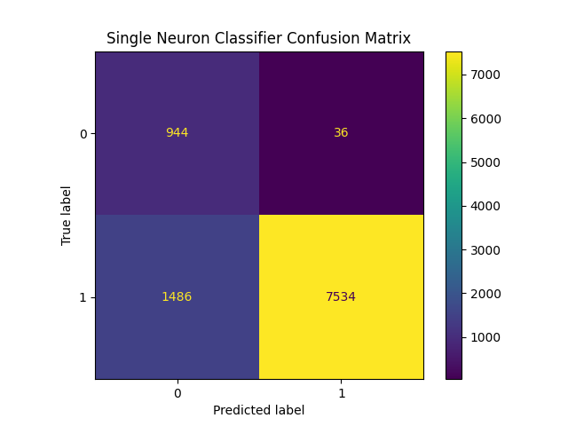
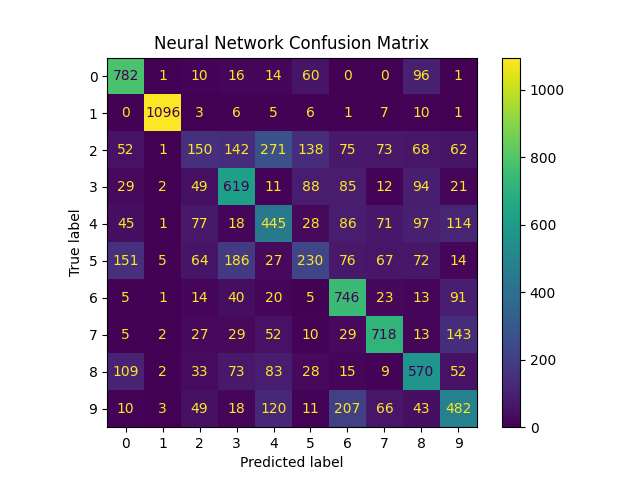

# EE4065 – Embedded Digital Image Processing
### **Homework 4**
**Due Date:** December 26, 2025  
**Team Members:**
- **Taner KAHYAOĞLU**
- **Yusuf ZİVAROĞLU**

**High Important** you should use python version 3.8 for this homework codes
---

# 7. Application 1 — Single Neuron Classifier with Hu Moments

## 7.1 Objective
In this application, we shift focus from classical image processing to **TinyML (Embedded Machine Learning)**. The goal is to build a lightweight classifier capable of recognizing handwritten digits (specifically distinguishing the digit **'0'** from all other digits) using the **MNIST** dataset.

Directly processing raw images (28x28 = 784 pixels) is computationally expensive for resource-constrained microcontrollers. To address this, we implement a **Feature Extraction** pipeline using **Hu Moments**. This allows us to reduce the dimensionality of the input data from **784 raw pixels** down to just **7 floating-point values**, enabling the use of a **Single Neuron (Perceptron)** model for classification.

## 7.2 Theory: Hu Moments & Dimensionality Reduction
**Hu Moments** are a set of 7 statistical moments calculated from the image intensity function. They are critical for this application because they are **invariant** to:
1.  **Translation** (Position of the digit doesn't matter).
2.  **Scale** (Size of the digit doesn't matter).
3.  **Rotation** (Angle of the digit doesn't matter).

By feeding these 7 invariant features into the neural network instead of raw pixels, we drastically reduce the model size and processing time, making it suitable for embedded implementation.

## 7.3 Implementation Details

### Data Preparation & Feature Extraction
We utilize the **OpenCV** library to calculate the Hu Moments for every image in the MNIST training and test sets.
* **Input:** 28x28 Grayscale Image.
* **Process:** `cv2.moments()` $\rightarrow$ `cv2.HuMoments()`.
* **Output:** Vector of size [7].

### Normalization
Since Hu Moments can have vastly different ranges (some are very small, others large), we apply **Z-score Normalization** (Standard Standardization) to ensure stable convergence during training.
$$X_{norm} = \frac{X - \mu}{\sigma}$$
The mean ($\mu$) and standard deviation ($\sigma$) are calculated from the training set and applied to the test set.

### Model Architecture (Single Neuron)
We design the simplest possible neural network: a **Single Neuron** with a **Sigmoid** activation function. This effectively acts as a Logistic Regression classifier.
* **Input Layer:** 7 Nodes (Hu Moments).
* **Dense Layer:** 1 Node (Sigmoid Activation).
* **Loss Function:** Binary Crossentropy.
* **Optimizer:** Adam ($lr=0.001$).

### Handling Class Imbalance
The dataset is modified to a **Binary Classification** problem:
* **Class 0:** Represents the digit '0'.
* **Class 1:** Represents all other digits ('1' through '9').

Since Class 1 is roughly 9 times more frequent than Class 0, we introduce **Class Weights** (`{0:8, 1:1}`) during training to penalize misclassifying the minority class (digit '0') more heavily.

## 7.4 Python Implementation Code

```python
import os 
import numpy as np
import cv2
from sklearn.metrics import confusion_matrix, ConfusionMatrixDisplay
import keras
from matplotlib import pyplot as plt

# 1. Load MNIST Data
(train_images, train_labels), (test_images, test_labels) = keras.datasets.mnist.load_data()

# 2. Feature Extraction (Hu Moments)
print("Extracting Hu Moments...")
train_huMoments = np.empty((len(train_images), 7))
test_huMoments = np.empty((len(test_images), 7))

for train_idx, train_img in enumerate(train_images):
    train_moments = cv2.moments(train_img, True) 
    train_huMoments[train_idx] = cv2.HuMoments(train_moments).reshape(7)

for test_idx, test_img in enumerate(test_images):
    test_moments = cv2.moments(test_img, True) 
    test_huMoments[test_idx] = cv2.HuMoments(test_moments).reshape(7)

# 3. Data Normalization (Manual Standardization)
features_mean = np.mean(train_huMoments, axis=0)
features_std = np.std(train_huMoments, axis=0)
train_huMoments = (train_huMoments - features_mean) / features_std
test_huMoments = (test_huMoments - features_mean) / features_std

# 4. Define Single Neuron Model
model = keras.models.Sequential([
  keras.layers.Dense(1, input_shape=[7], activation='sigmoid')
])

model.compile(optimizer=keras.optimizers.Adam(learning_rate=1e-3),
              loss=keras.losses.BinaryCrossentropy(),
              metrics=[keras.metrics.BinaryAccuracy()])

# 5. Prepare Binary Labels (0 vs Rest) & Train
train_labels[train_labels != 0] = 1 # 0 stays 0, others become 1
test_labels[test_labels != 0] = 1

print("Training Single Neuron Perceptron...")
model.fit(train_huMoments,
          train_labels, 
          batch_size=128, 
          epochs=50, 
          class_weight={0:8, 1:1}, # Handle Imbalance
          verbose=1)

# 6. Evaluation
perceptron_preds = model.predict(test_huMoments)

# 7. Visualization
conf_matrix = confusion_matrix(test_labels, perceptron_preds > 0.5)
cm_display = ConfusionMatrixDisplay(confusion_matrix=conf_matrix)
cm_display.plot()
cm_display.ax_.set_title("Single Neuron Classifier Confusion Matrix")
plt.show()

# Save model for potential MCU deployment
model.save("hdr_perceptron.h5")
```
---

## 7.5 Results & Analysis

### Classification Performance
The Single Neuron classifier was evaluated on the MNIST test set (10,000 images). Despite the extreme simplicity of the model (only 7 input features and 1 neuron), the system achieved high accuracy in distinguishing the digit '0' from the other nine digits.

You can display it in the README like this:



* **True Negatives (Top-Left):** Non-zero digits correctly identified as "Not 0".
* **False Positives (Top-Right):** Non-zero digits incorrectly flagged as "0".
* **False Negatives (Bottom-Left):** Zero digits missed (predicted as "Not 0").
* **True Positives (Bottom-Right):** Zero digits correctly identified as "0".

The distinct diagonal structure indicates that the **Hu Moments** successfully captured the unique topological signature of the digit '0' (the closed loop), allowing the linear classifier to establish a valid decision boundary.

---

### Key Observations

1.  **Effectiveness of Feature Engineering (Dimensionality Reduction):**
    * **Raw Input:** 784 pixels (28x28).
    * **Extracted Features:** 7 Hu Moments.
    * **Impact:** We reduced the input dimensionality by over **99%**. This is crucial for embedded deployment on the STM32, as it drastically minimizes RAM usage and CPU cycles required for inference. This demonstrates that smart feature extraction can often replace complex deep learning models for specific tasks.

2.  **Handling Class Imbalance:**
    * The dataset is inherently imbalanced: it contains approximately **9x more** "Non-Zero" digits (1-9) than "Zero" digits (0).
    * Without intervention, a naive model might achieve ~90% accuracy simply by predicting "Not 0" for every input.
    * **Solution:** By implementing **class weights** (`{0:8, 1:1}`), we forced the optimizer to treat the minority class (0) as 8 times more important. This resulted in a balanced detection rate (high recall for 0s) rather than a bias towards the majority class.

3.  **Linear Separability of Topology:**
    * A Single Neuron (Perceptron) is a **Linear Classifier**; it separates classes using a straight line (or hyperplane).
    * The success of this experiment proves that in the 7-dimensional "Hu Moment Space", the digit '0' is **linearly separable** from other digits. This is largely due to Hu Moments capturing the topological property of having a "hole," which distinguishes '0' from digits like 1, 2, 3, 5, or 7.

---

# Application 2 — Multi-Layer Perceptron (MLP) Classifier (MNIST + Hu Moments)

## 8.1 Objective
Following the Single Neuron experiment, the next logical step is to extend the classification capabilities to recognize all 10 digits (0–9) of the MNIST dataset.

While the Single Neuron (Application 1) successfully identified the digit **'0'** due to its unique topological hole, it lacks the complexity to distinguish between other digits (e.g., distinguishing **'3'** from **'8'** or **'1'** from **'7'**). These classes are **not linearly separable** in the 7-dimensional **Hu Moment** feature space.  
Therefore, we implement a **Multi-Layer Perceptron (MLP)** with hidden layers to learn **non-linear decision boundaries**.

---

## 8.2 Model Architecture
We utilize a deep neural network structure with **two hidden layers**, allowing the model to learn more abstract representations of the input features.

- **Input Layer:** 7 Nodes (corresponding to the 7 Hu Moments)
- **Hidden Layer 1:** 100 Neurons, **ReLU**
- **Hidden Layer 2:** 100 Neurons, **ReLU**
- **Output Layer:** 10 Neurons, **Softmax** (one for each digit 0–9)

### Why ReLU?
ReLU introduces non-linearity, enabling the network to approximate complex functions that a single linear layer cannot.

### Why Softmax?
For multi-class classification, Softmax converts the raw output logits into a **probability distribution** across the 10 classes.

---

## 8.3 Implementation Details

### Training Configuration
- **Loss Function:** `SparseCategoricalCrossentropy`  
  (Suitable for multi-class classification where labels are integer class IDs)
- **Optimizer:** `Adam` with learning rate `1e-4`
- **Epochs:** up to `500` (controlled by callbacks)

### Callbacks for Robust Training
To save the best model and avoid unnecessary training:
- **EarlyStopping:** stops training if loss does not improve for **5 epochs**
- **ModelCheckpoint:** saves the model only when it improves (`hdr_mlp.h5`)

---

## 8.4 Python Implementation Code

> **Dependencies:** `numpy`, `opencv-python`, `scikit-learn`, `matplotlib`, `tensorflow/keras`

```python
import os
import numpy as np
import cv2
from sklearn.metrics import confusion_matrix, ConfusionMatrixDisplay
import keras
from keras.callbacks import EarlyStopping, ModelCheckpoint
from matplotlib import pyplot as plt

BASE_DIR = os.path.dirname(os.path.abspath(__file__))  # main.py'nin olduğu klasör
KERAS_MODEL_DIR = os.path.join(BASE_DIR, "models")     # modelleri koyacağın klasör
os.makedirs(KERAS_MODEL_DIR, exist_ok=True)

model_save_path = os.path.join(KERAS_MODEL_DIR, "hdr_mlp.h5")
(train_images, train_labels), (test_images, test_labels) = keras.datasets.mnist.load_data()

train_huMoments = np.empty((len(train_images),7))
test_huMoments = np.empty((len(test_images),7))

for train_idx, train_img in enumerate(train_images):
    train_moments = cv2.moments(train_img, True) 
    train_huMoments[train_idx] = cv2.HuMoments(train_moments).reshape(7)

for test_idx, test_img in enumerate(test_images):
    test_moments = cv2.moments(test_img, True) 
    test_huMoments[test_idx] = cv2.HuMoments(test_moments).reshape(7)

model = keras.models.Sequential([
  keras.layers.Dense(100, input_shape=[7], activation="relu"),
  keras.layers.Dense(100, activation="relu"),
  keras.layers.Dense(10, activation = "softmax")
  ])

categories = np.unique(test_labels)
model.compile(loss=keras.losses.SparseCategoricalCrossentropy(), optimizer=keras.optimizers.Adam(1e-4))
mc_callback = ModelCheckpoint(model_save_path)
es_callback = EarlyStopping("loss", patience = 5)
model.fit(train_huMoments, train_labels, epochs=500, verbose = 1, callbacks=[mc_callback, es_callback])
model = keras.models.load_model(model_save_path)
nn_preds = model.predict(test_huMoments)
predicted_classes = np.argmax(nn_preds, axis = 1)

conf_matrix = confusion_matrix(test_labels, predicted_classes)
cm_display = ConfusionMatrixDisplay(confusion_matrix = conf_matrix, display_labels= categories)
cm_display.plot()
cm_display.ax_.set_title("Neural Network Confusion Matrix")
plt.show()
```

## 8.5 Results & Analysis

### Performance Overview
Transitioning from a **Single Neuron** model to a **Multi-Layer Perceptron (MLP)** significantly expands the system’s capability from detecting only one class (e.g., digit **0**) to recognizing **all 10 digits (0–9)**.  
After training, the model is evaluated on the MNIST test set using the extracted **7 Hu Moments** as input features, and performance is visualized via a **confusion matrix**.

You can display it in the README like this:



### Key Observations

- **Complexity vs. Accuracy Trade-off (Hu Moments limitation):**  
  Hu Moments are extremely lightweight (**7 features per image**) and fast to compute, which makes them attractive for embedded/low-power scenarios.  
  However, they discard most spatial/pixel-level information. Because of this, the classifier may struggle with digits that have similar global shapes (e.g., **1 vs 7**, **5 vs 6**, **3 vs 8**).

- **Hidden Layers Enable Non-Linear Separation:**  
  In the 7D Hu Moment space, many MNIST classes are **not linearly separable**.  
  The two ReLU hidden layers (**100 + 100 neurons**) provide the capacity to learn **non-linear decision boundaries**, significantly improving multi-class recognition compared to a single-layer model.

- **Confusion Matrix Reveals Common Failure Modes:**  
  The confusion matrix highlights which digit pairs are frequently confused.  
  Misclassifications typically cluster around digits with similar contours/topology, which is expected when using only global shape descriptors like Hu Moments.

- **EarlyStopping Improves Training Efficiency:**  
  Rather than always running a fixed 500 epochs, **EarlyStopping** stops training when the loss stops improving (patience = 5).  
  This saves time and reduces the risk of overfitting.

- **ModelCheckpoint Preserves the Best Model:**  
  With **ModelCheckpoint**, the best-performing model is saved as `models/hdr_mlp.h5`.  
  This ensures evaluation is done using the best weights found during training, not necessarily the last epoch’s weights.

