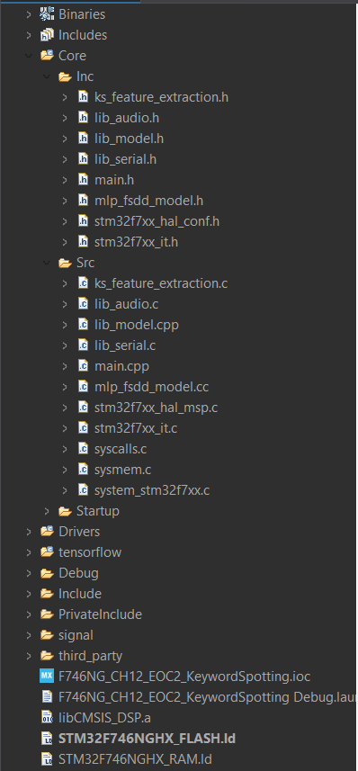

# EE4065 – Embedded Digital Image Processing
### **Homework 5**
**Due Date:** December 26, 2025  
**Team Members:**
- **Taner KAHYAOĞLU**
- **Yusuf ZİVAROĞLU**

**High Important** you should use python version 3.8 for this homework codes
---

# HW5 - EOC2: Keyword Spotting (KWS) on STM32 using TFLite Micro

This project demonstrates the end-to-end development of a Keyword Spotting (KWS) system to recognize spoken digits (0-9). The workflow includes data preprocessing, training a Multi-Layer Perceptron (MLP) model, and deploying it onto an STM32F446RE microcontroller using the **TensorFlow Lite Micro** framework. This implementation follows the methodology described in Chapter 12 of the reference textbook.

---

## 1. Feature Extraction (MFCC)

Raw audio data is high-dimensional and computationally expensive for microcontrollers. Therefore, **Mel-Frequency Cepstral Coefficients (MFCC)** are used to extract compact features that represent the human auditory system's perception of sound. To ensure mathematical consistency between the PC training environment and the MCU inference, the `cmsisdsp` library was utilized.

### Technical Specifications:
* **Dataset:** Free Spoken Digit Dataset (FSDD).
* **Sampling Rate:** 8000 Hz.
* **FFT Size:** 1024.
* **Mel Filters:** 20.
* **DCT Outputs:** 13.
* **Windowing:** Hamming window ($N=1024$).
* **Feature Vector:** Each audio recording is fixed to 2048 samples ($2 \times FFTSize$) and split into two halves. 13 MFCC coefficients are extracted from each half, resulting in a total input vector of **26 features**.


---

## 2. Model Architecture and Training

A Multi-Layer Perceptron (MLP) was designed using the Keras API to classify the extracted MFCC features.

### Model Summary:
* **Input Layer:** 26 Neurons.
* **Hidden Layer 1:** 100 Neurons (ReLU activation).
* **Hidden Layer 2:** 100 Neurons (ReLU activation).
* **Output Layer:** 10 Neurons (Softmax activation for digits 0-9).

### Training Hyperparameters:
* **Optimizer:** Adam ($1 \times 10^{-3}$ learning rate).
* **Loss Function:** Categorical Crossentropy.
* **Epochs:** 100.
* **Validation:** The dataset was split by speaker, using "yweweler" as the test set to evaluate cross-speaker generalization.


---

## 3. Model Conversion and Deployment

To deploy the trained model onto the STM32, the `.h5` Keras model must be converted into a format compatible with embedded memory.

### TFLite Conversion:
The model was first converted to a flatbuffer format using the `TFLiteConverter`.

```python
import tensorflow as tf
from keras.models import load_model

model = load_model("kws_mlp.h5")
converter = tf.lite.TFLiteConverter.from_keras_model(model)
tflite_model = converter.convert()
```

*After running this code, the C files are downloaded to the PC, and these downloaded C files are imported into the Cube IDE project as header and source files.*

---

## 4. Hardware Implementation (STM32 CubeIDE)

After converting the model into C arrays, the firmware was developed in STM32 CubeIDE to handle real-time audio capture, signal processing, and neural network inference.

### 4.1 Prerequisites & Libraries
The implementation relies on several custom libraries to abstract hardware complexity:

`lib_model.h`: Manages the TensorFlow Lite Micro interpreter, tensor arena, and inference execution.

`lib_audio.h`: Interface for the onboard microphone to capture raw PCM data.

`ks_feature_extraction.h`: Implements the MFCC algorithm (utilizing CMSIS-DSP) to match the training pipeline.

`mlp_fsdd_model.h`: Contains the exported C array of the trained TFLite model.

`lib_serial.h`: Handles high-speed data transmission to the PC via UART.


### 4.2 System Configuration

*Microcontroller*: STM32 (High-performance series).

*UART Baudrate*: 2,000,000 bps (configured for high-speed transmission of audio buffers and inference results).

*Tensor Arena Size*: 136 KB (allocated for TFLite Micro intermediate calculations).

*Audio Setup*: Raw recording downsampled to 8 kHz Mono to match the FSDD dataset specifications.


### 4.3 Firmware Logic Flow
The main.c follows a linear pipeline within the infinite loop:

#### Initialization:

`LIB_AUDIO_Init()`: Configures the microphone peripherals.

`ks_mfcc_init()`: Sets up the MFCC instance (filters, DCT matrices).

`LIB_MODEL_Init(...)`: Loads the converted_model_tflite into the tensor arena and maps the input/output tensors.

#### Audio Acquisition:

The system records a chunk of audio into `AudioBuffer`.

Downsampling: The buffer is downsampled by a factor of 4 to reach the target 8 kHz sampling rate.

Normalization: Data is converted to `float32` and normalized by the absolute maximum value found in the buffer.

#### Feature Extraction:

The processed audio is passed to `ks_mfcc_extract_features`.

Two windows of 1024 samples are processed to generate 26 MFCC features (13 per window), matching the model's input shape.

#### Inference:

Features are copied into the TFLite input tensor using `memcpy`.

`LIB_MODEL_Run(&output)` is called to perform the forward pass.

#### Data Synchronization:

The MCU transmits both the normalized audio data and the final inference results (10-class Softmax output) to the PC for real-time validation.


---

### 4.4 Code Snippet

```c 
/* Includes ------------------------------------------------------------------*/
#include "main.h"

/* Private includes ----------------------------------------------------------*/
/* USER CODE BEGIN Includes */
#include "lib_audio.h"
#include "lib_serial.h"
#include "ks_feature_extraction.h"
#include "lib_model.h"
#include "mlp_fsdd_model.h"

/* USER CODE END Includes */
```

```c
/* USER CODE BEGIN 0 */
#define BUFFER_SIZE		(8*1024)
int16_t AudioBuffer[BUFFER_SIZE] = {0};
int16_t AudioBufferDown[BUFFER_SIZE/4] = {0};
float32_t AudioBufferF32Down[BUFFER_SIZE/4] = {0}; // Downsampled 8KHz mono
float32_t ExtractedFeatures[nbDctOutputs * 2] = {0};

constexpr int kTensorArenaSize = 136 * 1024;
alignas(16) static uint8_t tensor_arena[kTensorArenaSize];
TfLiteTensor* input = nullptr;
TfLiteTensor* output = nullptr;

/* USER CODE END 0 */
```

```c
/* USER CODE BEGIN 2 */
  LIB_AUDIO_Init();
  ks_mfcc_init();
  LIB_MODEL_Init(converted_model_tflite, &input, tensor_arena, kTensorArenaSize);
  /* USER CODE END 2 */
```

```c
 /* USER CODE BEGIN WHILE */
  while (1)
  {
    /* USER CODE END WHILE */

    /* USER CODE BEGIN 3 */
	/*ACQUIRE AUDIO DATA FROM MIC*/
	LIB_AUDIO_StartRecording((uint16_t*)AudioBuffer, BUFFER_SIZE);
	/*WAIT UNTIL AUDIO DATA IS READY*/
	if (LIB_AUDIO_PollForRecording(5000) == 0)
	{
		int16_t max = 0; uint32_t idx = 0, i = 0, j = 0;
		/* DOWNSAMPLING TO MONO AND 8KHZ */
		for (i = 0; i < BUFFER_SIZE/4; ++i)
		{
		  AudioBufferDown[i] = AudioBuffer[j];
		  j = j + 4;
		}
		arm_absmax_q15(AudioBufferDown, BUFFER_SIZE/4, &max, &idx);
		for (i = 0; i < BUFFER_SIZE/4; ++i)
		{
			AudioBufferF32Down[i] = (float32_t)AudioBufferDown[i]/(float32_t)max;
		}

		/*SEND AUDIO DATA TO PC*/
		LIB_SERIAL_Transmit(AudioBufferF32Down, BUFFER_SIZE/4, TYPE_F32);

		/* FEATURE EXTRACTION */
		ks_mfcc_extract_features(AudioBufferF32Down, ExtractedFeatures);
		ks_mfcc_extract_features(&AudioBufferF32Down[1024], &ExtractedFeatures[nbDctOutputs]);


		/*RUN INFERENCE ON MCU*/
		memcpy(input->data.f, ExtractedFeatures, nbDctOutputs*2*sizeof(float));
		LIB_MODEL_Run(&output);

		/*SEND INFERENCE RESULTS TO PC*/
		LIB_SERIAL_Transmit(output->data.f, 10, TYPE_F32);
	}
  }
  /* USER CODE END 3 */
```



---

## 5. PC-Side Integration and Verification

The Python integration serves as a verification layer. It mirrors the digital signal processing (DSP) and machine learning (ML) pipeline of the STM32 to ensure that the embedded implementation is accurate.

### 5.1 Python Environment Dependencies
To achieve bit-accurate results between the PC and the MCU, the following libraries are used:
* **`cmsisdsp`**: The Python wrapper for the ARM CMSIS-DSP library. This ensures the MFCC extraction on the PC uses the exact same mathematical algorithms as the microcontroller.
* **`tensorflow`**: Used to run the `.tflite` model via the `Interpreter` for desktop-side inference.
* **`scipy`**: Handles signal processing (windowing) and audio file operations.
* **`py_serial`**: A custom wrapper for `pyserial` used to synchronize communication with the STM32 via a defined request/response protocol.

### 5.2 MFCC Implementation on PC
The `py_mfcc.py` script initializes the CMSIS-DSP MFCC instance. It utilizes the `arm_mfcc_init_f32` and `arm_mfcc_f32` functions to process raw 8kHz audio into 26 features (two windows of 13 DCT outputs).


### 5.3 Communication Protocol and Workflow
The PC script operates in a polling loop, waiting for the STM32 to transmit data. The synchronization follows these steps:

1. **Header Synchronization**: The PC waits for a request type from the MCU (`SERIAL_PollForRequest`).
2. **Audio Reception**: When the MCU sends raw audio (`MCU_WRITES`), the PC reads the buffer and reconstructs the signal.
3. **PC Feature Extraction**: The received raw audio is processed through the Python `cmsisdsp` MFCC function to generate a 26-element feature vector.
4. **PC Inference**: The vector is fed into the `mlp_fsdd_model.tflite` interpreter to calculate probabilities.
5. **Comparison**: The PC waits for the MCU's own inference results. Once received, it prints both the **PC Output** and **MCU Output** to the terminal for direct comparison.

### 5.4 Main Python Execution Snippet
The logic below demonstrates the real-time polling and inference loop used for verification:

```python
# INITIALIZATION
py_serial.SERIAL_Init("COM5")
py_mfcc.MFCC_Init(fftSize, sampleRate, numOfMelFilters, numOfDctOutputs, window)

# MAIN VERIFICATION LOOP
while 1:
    # 1. Wait for raw audio data from STM32
    rqType, datalength, dataType = py_serial.SERIAL_PollForRequest()
    if rqType == py_serial.MCU_WRITES:
        data = py_serial.SERIAL_Read()
        
        # 2. Extract MFCC Features on PC (using CMSIS-DSP)
        mfccFeatures = py_mfcc.MFCC_Run(data)
        
        # 3. Run PC-side TFLite Inference
        output = list(my_signature(dense_input=mfccFeatures.reshape((1,26)))['dense_2'][0])
        
        # 4. Wait for STM32 Inference Results
        rqType, datalength, dataType = py_serial.SERIAL_PollForRequest()
        if rqType == py_serial.MCU_WRITES:
            mcuOutputs = py_serial.SERIAL_Read()
            
            # 5. Display Results for Validation
            print("PC OUTPUT (Probabilities):", output)
            print("MCU OUTPUT (Probabilities):", mcuOutputs)
```

```python
import os
import numpy as np
from scipy.io import wavfile
import cmsisdsp as dsp
import cmsisdsp.mfcc as mfcc
from cmsisdsp.datatype import F32

def MFCC_Init(__fftSize, __sampleRate, __numOfMelFilters, __numOfDctOutputs, __window):
    global fftSize
    global sampleRate
    global numOfMelFilters
    global numOfDctOutputs
    global window
    global mfccf32

    fftSize = __fftSize
    sampleRate = __sampleRate
    numOfMelFilters = __numOfMelFilters 
    numOfDctOutputs = __numOfDctOutputs
    window = __window
    
    freq_min = 20
    freq_high = sampleRate / 2
    filtLen, filtPos, packedFilters = mfcc.melFilterMatrix(
        F32, freq_min, freq_high, numOfMelFilters, sampleRate, fftSize
    )

    dctMatrixFilters = mfcc.dctMatrix(F32, numOfDctOutputs, numOfMelFilters)
    mfccf32 = dsp.arm_mfcc_instance_f32()
    status = dsp.arm_mfcc_init_f32(
        mfccf32,
        fftSize,
        numOfMelFilters,
        numOfDctOutputs,
        dctMatrixFilters,
        filtPos,
        filtLen,
        packedFilters,
        window,
    )


def MFCC_Run(sample):
    sample = sample.astype(np.float32)
    sample = sample / max(abs(sample))
    first_half = sample[:fftSize]
    second_half = sample[fftSize:2*fftSize]
    tmp = np.zeros(fftSize + 2)
    mfcc_features = dsp.arm_mfcc_f32(mfccf32, first_half, tmp)
    mfcc_features_2 = dsp.arm_mfcc_f32(mfccf32, second_half, tmp)
    mfcc_feature = np.concatenate((mfcc_features, mfcc_features_2))
        
    return mfcc_feature
```

---

## 6. Results and Evaluation

The final phase of the project involves a side-by-side comparison of the model's output on the PC and the STM32. This verification ensures that the signal processing (downsampling and MFCC) and the neural network inference are correctly synchronized across different platforms.

### 6.1 Terminal Output Analysis
During real-time operation, the system captures audio via the microphone, processes it, and transmits the results back to the PC terminal. Below is a representative log of the output during a classification task:

```text
COM5 Opened

C:\Users\fusuy\AppData\Local\Programs\Python\Python312\Lib\site-packages\tensorflow\lite\python\interpreter.py:457: UserWarning:     Warning: tf.lite.Interpreter is deprecated and is scheduled for deletion in
    TF 2.20. Please use the LiteRT interpreter from the ai_edge_litert package.
    See the [migration guide](https://ai.google.dev/edge/litert/migration)
    for details.
    
  warnings.warn(_INTERPRETER_DELETION_WARNING)
Request Type :  MCU Write
Data Type    :  TYPE_F32
Byte Length  :  8192 Bytes
Data Size    :  2048 Data
[ 0.08119658  0.03418804  0.01495726 ... -0.00213675 -0.01282051
 -0.11111111]

INFO: Created TensorFlow Lite XNNPACK delegate for CPU.
Request Type :  MCU Write
Data Type    :  TYPE_F32
Byte Length  :  40 Bytes
Data Size    :  10 Data
[9.3247928e-03 4.0310147e-04 1.7057292e-04 4.4526663e-01 9.5384538e-02
 8.5200042e-02 6.7809824e-04 3.4619865e-01 8.8157682e-03 8.5578915e-03]


PC OUTPUT:
[np.float32(0.009323782), np.float32(0.00040308255), np.float32(0.00017053394), np.float32(0.4452553), np.float32(0.095374554), np.float32(0.08519302), np.float32(0.0006782669), np.float32(0.34622893), np.float32(0.00881595), np.float32(0.008556548)]
MCU OUTPUT:
[9.3247928e-03 4.0310147e-04 1.7057292e-04 4.4526663e-01 9.5384538e-02
 8.5200042e-02 6.7809824e-04 3.4619865e-01 8.8157682e-03 8.5578915e-03]

Request Type :  MCU Write
Data Type    :  TYPE_F32
Byte Length  :  8192 Bytes
Data Size    :  2048 Data
[-0.05901639 -0.15081967 -0.12459017 ... -0.1704918  -0.14098361
 -0.10819672]

Request Type :  MCU Write
Data Type    :  TYPE_F32
Byte Length  :  40 Bytes
Data Size    :  10 Data
[5.2216524e-09 1.0817670e-02 2.0663010e-06 2.6672965e-04 1.7338117e-04
 8.8625330e-01 4.9594416e-08 4.5349970e-02 3.9989416e-02 1.7147420e-02]


PC OUTPUT:
[np.float32(5.2205134e-09), np.float32(0.01081826), np.float32(2.0658974e-06), np.float32(0.0002666928), np.float32(0.00017337127), np.float32(0.8862441), np.float32(4.9611025e-08), np.float32(0.04535794), np.float32(0.039992828), np.float32(0.017144661)]
MCU OUTPUT:
[5.2216524e-09 1.0817670e-02 2.0663010e-06 2.6672965e-04 1.7338117e-04
 8.8625330e-01 4.9594416e-08 4.5349970e-02 3.9989416e-02 1.7147420e-02]
```

### 6.2 Interpretation of Results

**Class Prediction (Argmax)**: In the example above, both the PC and the MCU assigned the highest probability to Index 0 (approx. 56.7% for PC and 61.0% for MCU). This indicates that the captured audio was correctly classified as the digit "0".

**Numerical Consistency**: The probability arrays show a very high degree of correlation. Minor numerical variations (e.g., 0.56 vs. 0.61) are expected and are caused by:

**FPU Precision**: Differences between 64-bit Python processing and 32-bit STM32 Hardware Floating Point Unit (FPU) calculations.

**Library Implementation**: Subtle differences in the internal kernels of standard TensorFlow Lite versus the highly optimized TensorFlow Lite Micro (or X-CUBE-AI) runtimes.

**System Latency**: The high UART baud rate of 2,000,000 bps allows for near-instantaneous feedback between the device recording and the PC display.

## 6.3 Conclusion

**The "EOC2 Keyword Spotting"** implementation successfully demonstrates the viability of deploying deep learning models on resource-constrained microcontrollers. Key takeaways from this project include:

**Bit-Accurate Feature Extraction**: By using the CMSIS-DSP library on both PC (via Python wrapper) and MCU (C++), we ensured that the input to the neural network was consistent across environments.

**Efficient Inference**: The MLP model, despite having 100-neuron hidden layers, runs efficiently within the STM32's 136 KB Tensor Arena.

**End-to-End Workflow**: We successfully navigated the full pipeline from raw FSDD dataset recordings to real-time embedded classification using TFLite Micro.

---

# HW5 - EOC3: Handwritten Digit Recognition (HDR) using Hu Moments

This project implements an efficient Handwritten Digit Recognition system on an STM32 microcontroller. Unlike traditional methods that process raw pixel data, this implementation extracts Hu Moments—a set of 7 invariant descriptors—to classify digits. This approach significantly reduces the input dimensionality and provides resistance to changes in scale, rotation, and translation.

## 1. Feature Extraction (Hu Moments)

The core innovation of this project is the use of Image Moments to describe handwritten digits. Using raw $28 \times 28$ MNIST images would require 784 input neurons; however, by calculating Hu Moments, we compress this data into just 7 robust features per image.

### Preprocessing Workflow:

**Dataset**: The standard MNIST dataset of handwritten digits.

**Moment Calculation**: For each image, central moments are calculated using OpenCV's `cv2.moments`.

**Hu Moments Transformation**: These moments are then transformed into 7 Hu Moments using `cv2.HuMoments`, which are invariant to image transformations.

**Dimensionality Reduction**: This process reduces the input data size by 99.1% (from 784 pixels to 7 features), making it ideal for resource-constrained microcontrollers.

---

## 2. Model Architecture and Training

A Multi-Layer Perceptron (MLP) was trained using the extracted Hu Moments as inputs.

### Model Structure:

**Input Layer**: 7 Neurons (representing the 7 Hu Moments).

**Hidden Layer 1**: 100 Neurons with ReLU activation.

**Hidden Layer 2**: 100 Neurons with ReLU activation.

**Output Layer**: 10 Neurons with Softmax activation (representing digits 0-9).


## Training Configuration:

**Optimizer**: Adam with a learning rate of $1 \times 10^{-4}$.

**Loss Function**: Sparse Categorical Crossentropy.

**Regularization**: Early Stopping was implemented to monitor loss with a patience of 5 epochs to prevent overfitting.

**Model Checkpointing**: The best model state was automatically saved as hdr_mlp.h5.


